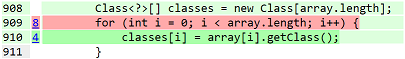
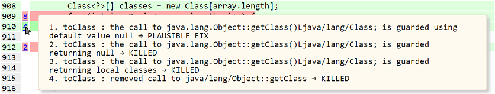
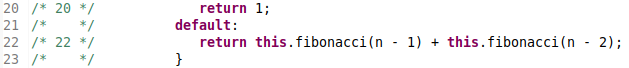

[](https://search.maven.org/search?q=g:%22org.mudebug%22%20AND%20a:%22prapr-plugin%22)

> ##### Source code of PraPR is now available at [PraPR-SC](https://github.com/ali-ghanbari/prapr-sc).

# PraPR: Practical Program Repair via Bytecode Mutation

## Table of Contents
- [Introduction](#introduction)
- [PraPR Setup](#prapr-setup)
    * [Maven Plugin](#maven-plugin)
    * [Gradle Plugin](#gradle-plugin)
    * [Docker Image](#docker-image)
- [PraPR Demonstration](#prapr-demonstration)
    * [Fixing Lang-33 from Defects4J](#fixing-lang-33-from-defects4j)
    * [Fixing jejin-984f75 from Defexts](#fixing-jejin-984f7567-from-defexts)
    * [Fixing Toy Programs](#fixing-toy-programs)
- [PraPR Reports](#prapr-reports)
    * [Dumped Mutants](#dumped-mutants)
    * [Configuring Eclipse Class Decompiler](#configuring-eclipse-class-decompiler)
- [PraPR Patches](#prapr-patches)
- [System Requirements](#system-requirements)
- [Publications](#publications)
    * [PraPR on YouTube](#prapr-on-youtube)

## Introduction

PraPR is a simplistic, yet effective, automatic program repair (APR) technique based on simple mutation operators.
This repository is the official website for PraPR. This document, besides explaining how one can use PraPR, presents the main features of the tool.

We reiterate that PraPR, being a JVM bytecode-level APR, is able to fix JVM programming languages other than Java.
Most of these languages (including Kotlin) are compatible with Maven, so our Maven plugin could be used for any
Maven-based Kotlin project. However, since most of the times Kotlin developers tend to use Gradle as their build
system, we have also included a Gradle plugin for PraPR which we are going to explain in this document.

## PraPR Setup
PraPR can be used in two main forms: as a [Maven plugin](#maven-plugin) or as a [Gradle plugin](#maven-plugin).
In order to facilitate demonstration, we have also prepared a [Docker image](#docker-image) through which the users can try PraPR.

### Maven Plugin
PraPR is available on [Maven Central Repository](https://repo.maven.apache.org/maven2/) in the form of a Maven
plugin. You can obtain the plugin for PraPR by just configuring your target POM file.

In order to see how PraPR works, you will need a buggy program. We have prepared four of them for your convenience;
they are located in the subdirectory `examples`. Before giving the instructions special to the example programs,
let's see how we can configure a buggy program so that PraPR can fix it. We need to stress that the program, in order
to be fixed by PraPR, has to have a test suite with at least one failing test case. All you need to do is to add the
following snippet in the POM file for the target program:
```xml
<plugins>
	<plugin>
		<groupId>org.mudebug</groupId>
		<artifactId>prapr-plugin</artifactId>
		<version>2.0.2</version>
		<configuration>
			<threads> <!-- NUMBER OF THREADS TO BE USED DURING MUTATION --> </threads>
			<mutators>
                <!-- <mutator>ALL</mutator> ACTIVATES ALL THE AVAILABLE MUTATORS -->
				<!-- OR YOU CAN SELECTIVELY ACTIVATE THE MUTATORS BY LISTING THEIR IDENTIFIERS HERE -->
                <!-- <mutator>PIT</mutator> ACTIVATES TRADITIONAL MUTATORS -->
                <!-- <mutator>PRAPR</mutator> ACTIVATES ALL THE MUTATORS SPECIFIC TO PRAPR -->
			</mutators>
			<outputFormats>
				<!-- YOU CAN DETERMINE FORMAT OF THE FIX REPORT HERE -->
				<!-- <param>COMPRESSED-XML</param> SUITABLE FOR POST PROCESSING -->
				<!-- <param>LOG</param> HUMAN READABLE RANKED LIST -->
				<!-- <param>HTML</param> HUMAN READABLE VISUALIZED REPORT -->
			</outputFormats>
            <testPlugin>
                <!-- COULD BE "junit" (default), "testng", or "junit5" -->
            </testPlugin>
            <!-- ET CETERA -->
		</configuration>
        <!-- IN CASE YOU DECIDED TO USE JUNIT 5, AFTER SETTING THE VALUE OF testPlugin TO "junit5" -->
        <!-- YOU WILL NEED TO ADD THE FOLLOWING DEPENDENCY INFORMATION HERE -->
        <!-- <dependencies>
            <dependency>
                <groupId>org.pitest</groupId>
                <artifactId>pitest-junit5-plugin</artifactId>
                <version>0.4</version>
            </dependency>
        </dependencies> -->
	</plugin>
</plugins>
```
Once you configured the POM file (by filling the blanks as you wish), you can try the following command to run
PraPR. This will automatically download PraPR plugin (and all of its dependencies), and begin fixing the program.
```sh
mvn org.mudebug:prapr-plugin:prapr
```
Please note that for the sake of maximizing compatibility of PraPR with the existing platforms, we choose to
compile the tool using JDK 1.7. Thus, if you have got JDK 1.7+ on your machine, you will have no problem running
PraPR using the above command. However, since Defects4J programs are not compatible with newer versions of JDK, you
want to fix those programs using JDK 1.7. If you are using this for the first time, you might encounter a problem.
This is because as of June 2018, Maven team (due to security reasons) have disabled the address for the central
repository that once used to be the default address. You can easily work around this problem by using an additional
switch in the command line when you invoke Maven.
```sh
mvn org.mudebug:prapr-plugin:prapr -Dhttps.protocols=TLSv1.2
```
There are also several command-line options that you might want to know; these include but not limited to:
* `-DverboseReport=false` instructs PraPR to not to generate dump class files. This flag is, by default, true so that PraPR generates a subdirectory inside reports directory and dumps there all the class files corresponding to each plausible fix.
* `-DsuspStrategy` determines the formula for computing suspiciousness values for mutations. Default value for this property is `OCHIAI` which means that PraPR, by default, uses Ochiai formula to assign suspiciousness values for mutations. You can also try other formulae such as `TARANTULA`. This is highly extensible, and the user can extend PraPR by adding more fault localization formulae.
* `-DreorderTestCases=false` disables the heuristic reorder of test cases that is meant to maximize the chance of triggering of early exit during mutation testing.
#### Support for Multi-module Maven Projects
By default, for each sub-module within a multi-module project, PraPR (similar with PIT) repairs only the classes defined in the same module as the test suite. However, in practice, the tests within a sub-module may test source code defined within another sub-module. In that case, you can fire the following command from the root directory of the project to be repaired:

```sh
mvn org.mudebug:prapr-plugin:praprM
```

Note that a multi-module project may have a large number of modules, and you do not want to repair all of them (e.g., you only want to repair the ones with test failures). In this way, you can configure the following options to optimize your repair experience:

`targetModules`: running PraPR only on certain target modules (e.g., the modules with test failures). You can simply use it from the command line with `-DtargetModules=firstModule,secondModule`, or from the `pom.xml`:

```xml
<targetModules>
	<param>firstModule</param>
        <param>secondModule</param>
</targetModules>
```

`excludedModules`: filtering out certain modules (e.g., the modules without test failures) for PraPR. You can simply use it from the command line with `-DexcludedModules=firstModule,secondModule`, or from the `pom.xml`:

```xml
<excludedModules>
	<param>firstModule</param>
        <param>secondModule</param>
</excludedModules>
```
	
### Gradle Plugin
In case that you want to use Gradle, we have prepared a plugin for Gradle through which you can run PraPR. You can
find the JAR file for PraPR's Gradle plugin under the directory `prapr-gradle-plugin` in this repository. Once you
download the file `prapr-gradle-plugin-2.0.0.jar`, you can put it in a directory that will be used as an alternative
to Maven local repository. Let's assume that the file is downloaded inside a directory named `my-gradle-repo`. You
can instruct Gradle to use this directory as a last resort when looking for the plugin for PraPR by using the
following command in its appropriate place inside the build script, i.e. `build.gradle`.
```groovy
repositories {
    flatDir { dir '/path/to/my-gradle-repo' }
    // et cetera
}
```
Once you set a mirror for the local repository, you can add the plugin into the classpath and invoke it. This is
done through the following command.
```groovy
dependencies {
    classpath 'org.mudebug.gradle.prapr:prapr-gradle-plugin:2.0.0'
    // et cetera
}
```
With that being set, you may apply and configure PraPR plugin as follows.
```groovy
apply plugin: 'org.mudebug.prapr'

prapr {
    threads = /*number of threads*/
    outputFormats = [/*output formats, such as "HTML" and "LOG"*/]
    targetClasses = [/*target classes to be mutated*/]
    testPlugin = [/*test plugin which could be "junit" (which supports JUnit up to 4.6), "testng", or "junit5"*/]
    // et cetera
}
```
It is worth noting that you may omit either (or all) of the properties listed in `prapr` block. Once you omit,
the Gradle plugin for PraPR uses default values for the omitted properties. The default value for `threads` is 1,
while the default value for `outputFormats` is `HTML`, `LOG`, and `COMPRESSED-XML`, and that of `targetClasses`
is `groupId.*` where `groupId` is the *group ID* for the project.

Please note that in order to be able use JUnit 5, you will need to refer to an external library. Fortunately, this
library is readily available in Maven Central Repository. You can refer to JUnit 5 library through the following
commands used at their appropriate place inside the build script.
```groovy
configurations.maybeCreate('prapr')
dependencies {
    prapr 'org.pitest:pitest-junit5-plugin:0.4'
    // et cetera
}
```
After configuring the build file you can invoke PraPR by using the command `gradle prapr-repair` in the
command-line at the root of the project.
### Docker Image
The easiest way to try PraPR is to use our Docker image. We have shipped a pre-configured
version of PraPR in the form of a Docker image ([https://hub.docker.com/r/prapr/prapr](https://hub.docker.com/r/prapr/prapr)).
Using this image the users will have access to PraPR and all the bugs that we have tested PraPR with.

In order to be able to use our Docker image, you need to have an instance of Docker installed on your computer.
Please follow the [installation instructions](https://docs.docker.com/v17.12/install/) specific to your operating system,
and install Docker on your computer.

Once you installed Docker, before trying the following commands, please make sure that it is running and is ready to be used.
```sh
sudo docker logout
sudo docker container run -it prapr/prapr
```
These commands (that are intended to be executed on a Linux terminal) will fetch PraPR image and run the container.
Please note that the first command is necessary for newer versions of Docker.
Note further that Mac OS or Windows users do not need to prefix the commands with `sudo`;
they can simply use the following commands to get PraPR running.
```sh
docker logout
docker container run -it prapr/prapr
```
After downloading the image, the system will automatically begin executing the PraPR image,
which is a pre-configured Ubuntu Linux. Once started, the system will automatically be redirected to
`/home/prapr/`. We have provided the users with two commands using which they can fetch a
Defect4J (or Defexts) bug, or invoke PraPR. The following command shall invoke PraPR wrapper
and show all the bugs ids that this Docker image recognizes.
```sh
prapr-fix --all-bugs
```
Bug ids are in the form of `subject-bug` where `subject` is the subject project name
(e.g. `Chart`, `Time`, etc.), and `bug` is the bug number. For example, `Lang-10` identifies
the bug Lang-10 from Defects4J (we stress that the wrapper script is case sensitive).
Once we know the bug ids, we can invoke PraPR on the bug using the following command.
```sh
prapr-fix subject-bug
```
This command downloads the designated bug, before configuring and invoking PraPR on it.
For example, `prapr-fix Lang-10` downloads the bug Lang-10, and applies PraPR on it.

We can use the command `checkout subject-bug` to download the bug without invoking PraPR.
All the downloaded bugs will be stored in the home directory of the container at `/home/prapr`.

*Note*: Except for `Closure` bugs (and a number of `Math` bugs), PraPR needs less than 16 GB of RAM.
Some `Closure` bugs might need up to 64 GB of RAM.

*Note*: The Linux that we have shipped takes some space on your disk. Also downloading the bugs, and
trying them, will quickly add up. So, please make sure that you have at least 50 GB of free space on
your root drive (`/` on Unix, and `C:` on Windows, systems).

## PraPR Demonstration
We have prepared two real-world programs (one Java and one Kotlin) and two toy programs (one Java and one Kotlin). 
The real-world Kotlin program uses Gradle, while the rest use Maven. These examples demonstrate how PraPR is able
to run under different build systems and applied on different JVM languages.

In order to get PraPR fix these programs, we recommend cloning this repository, and navigate into it, using the
following commands in your command-line:
```sh
git clone https://github.com/prapr/prapr.git
cd prapr
```
### Fixing Lang-33 from Defects4J
Apache Commons Lang is a large, Maven-based Java project. Lang 33, is indeed Apache Commons Lang with bug Lang-#33
of Defects4J in it. The bug is located in line 910 of `org/apache/commons/lang3/ClassUtils.java`. This bug is a
non-trivial, real-world bug, and could be fixed by doing the following replacement. We have to replace
```java
classes[i] = array[i].getClass();
```
with
```java
classes[i] = array[i] == null ? null : array[i].getClass();
```
You can use PraPR to fix the bug by executing the following commands (please note that Defects4J programs
need JDK 1.7 to work).
```sh
cd examples
cd Defects4J
cd Lang-33
mvn clean test -DskipTests
mvn org.mudebug:prapr-plugin:prapr
```
After seeing the (green) `BUILD SUCCESS` message, you can examine the fix reports so that you can apply the
appropriate plausible fix. The reports, as well as all the supporting information, will be placed under the
directory `{$project.base}/target/prapr-reports/*/`, where `*` is a number representing the time and date at
which the tool is ran. Under that directory you can find `fix-report.log` which is a human readable, ranked
list of fixes. You might also want to use the visualized report by opening `index.html` in a web-browser.
Please refer to the Secion [Reporting](#prapr-reports) for more information about fix reports. You can find
dumped mutations under the subdirectory `pool`. With the help of the LOG file and a decompiler installed on
your favorite IDE, you can see how patches can be applied in the source code.
### Fixing jejin-984f7567 from Defexts
jejin is a large, real-world Gradle-based Kotlin program that contains more than 9700 lines of code all in
Kotlin. The bug jejin-984f7567 is fixable by replacing
```kotlin
this::class.declaredMemberProperties.forEach {
```
with
```kotlin
this::class.memberProperties.forEach {
```
at line 22 of `jenjin-core/src/main/kotlin/com/binarymonks/jj/core/components/Component.kt` which is located
inside the subproject `jejin-core`. This suggests that bug is located inside the subproject `jejin-core` and
other subprojects do not need to be fixed. We could gain the same information by compiling the project and
running test cases. We would realize that only test cases of the subproject `jejin-core` fail. This suggests
that we don't need to waste resources by running PraPR on other subprojects of this huge project, and we can
fix the bug just by applying the plugin on the subproject that actually contains the bug. We have already
done this for you and you can read the build script and grasp the details.

In order to fix this program using the following commands (please note that jejin requires JDK 1.8 and Gradle
4.9 to work)
```sh
cd examples
cd Defexts
cd jenjin-984f7567c83df2778b3d7887380839b757008340
gradle clean build -x test
gradle prapr-repair
```
After seeing the (green) `BUILD SUCCESSFUL` message, you can go ahead and get the LOG file from the *build*
directory located at `{$project.base}/jejin-core/build/reports/prapr-report/*/fix-report.log`. As you can
see, the LOG report is placed inside the build directory of the suproject `jejin-core`.

### Fixing Toy Programs
There is a small Java, and also a small Kotlin, program inside `examples` directory. We thought some
reviewers might find smaller programs with seeded bugs useful for demonstration and comprehension. The
Java program is located at `examples/toy-java-program/`, while the Kotlin program is located at
`examples/toy-kotlin-program/`. The bug for the Java program is located in line 22 of
`com/example/Lib.java`, and the bug for the Kotlin program is located in line 18 of `hello/KotlinHello.kt`.
One can follow the same instructions for fixing Lang-33 and jejin-984f75 to fix these programs.

## PraPR Reports
PraPR is able to produce two kinds of human readable fix reports. The file `fix-report.log` is a ranked list of
fixes. The ranking scheme employed by PraPR is described in the paper. This file also provides the total number
of plausible fixes, as well as patches, that are generated. Last but not least, LOG files specify the name of the
dump file for each mutant which is a plausible fix, so that the user can refer to pool of [dumped mutants](#dumped-mutants)
so as to retrieve the dump file and examine its contents in an IDE. In this way, the user can clearly understand
how a patch looks like when it is applied on the source code.

PraPR also produces a visualized HTML report, so that the users can actually see the place and description of fixes
in the context of subject program source code. Please note that the report contains only suspicious code elements,
so that the user will not *get lost* in a huge HTML page.

Here are two screenshots from the gerenated HTML files. The lines that are covered are highlighed using pale green
color, while lines with a killed mutation applied on them are highlighted with pink, and plausible fixes are
highlighted with a darker green.



The user can hover the mouse pointer over the line number and see the details of mutations applied at that line.



PraPR also visualizes the number of plausible fixes, as well as all patches. For larger projects this will help the
users a lot in locating the place of a plausible fix (they do not need to look into classes/packages that do not
have any plausible fixes). The following screenshot illustrates an example.


Finally, PraPR has inherited the capability of producing XML reports from PIT. XML reports are meant to be
processed by machine. Since XML report can grow very large for programs like Closure, PraPR compresses the XML files
that it produces. The XML contents are compressed using gzip format.

### Dumped Mutants
For each plausible fix, PraPR dumps the resulting mutant inside the subdirectory `pool` under the directory
`prapr-reports/*/`. From the LOG file generated by PraPR, one will know which dump file corresponds to which plausible
fix. Dump files are essentially `.class` files corresponding to the mutated class that contains the plausible
patch. The user can take advantage of a Java bytecode decompiler to decompile the resulting class file.
[Eclipse Class Decompiler](http://www.cpupk.com/decompiler/) is a sophisticated decompiler that is able to retrieve
the original line numbers and align the line numbers in the mutated code with that of the original source code.

Eclipse Class Decompiler is freely available as an Eclipse plugin. Below you can see a screenshot from
the decompiled mutant corresponding to the genuine patch for the toy Java example.

Mutant for the genuine fix:



### Configuring Eclipse Class Decompiler
We are in the process of integrating a class decompiler into PraPR, for better user experience. For the time being,
however, we are taking advantage of an Eclipse plugin for showing the patches inside the target program. We thought
it might be a little bit confusing for some users to work with Eclipse Class Decompiler, so we are going to give
the instructions on configuring the plugin. Installation directions, as well as how to configure default file
association, is already given in the official website of the plugin.

After installing the plugin, you will need to open the window "Preferences" from "Window -> Preferences." In that
window, under the item "Java," select the item "Decompiler." Then select the appropriate decompiler library from
the drop-down list "Default Class Decompiler." We recommend "FernFlower" which supports JDK 1.8. After selecting
the library, you will need to check both items "Output original line numbers as comments," and
"Align code for debugging."

Finally, you should select the item "Disassember" under the item "Decompiler," and check the item
"Show source line numbers."

## PraPR Patches
We have prepared a set of patch files based on the diff between the decompiled mutants corresponding to each
plausible patch that we believe they are genuine fixes (almost all of them are syntactically the same as the
programmer-written patches and reasoning about those patches that are not syntactically the same is quite easy).
These patches are located under the subdirectory `patches` of this repository. Please note that programmer-written
patches are already shipped with [Defects4J](https://github.com/Greg4cr/defects4j/tree/additional-faults-1.4) and
[Defexts](http://www.github.com/defexts/defexts) and reviewers can refer to those.

## System Requirements
* OS: Ubuntu Linux or Mac OS X.
* Build System: Maven 3.2+ or Gradle 4.8+.
* JDK: Oracle Java SE Development Kit 7u80 (recommended for Defects4J) and 8u171 (recommended for Defexts).
* IDE: Eclipse Oxygen.

## Publications
PraPR is a research project and part of [Ali Ghanbari](https://ali-ghanbari.github.io/)'s Ph.D. thesis at [The University of Texas at Dallas](https://www.utdallas.edu/). The paper that introduces the idea of PraPR, and conducts an extensive empirical study on state-of-the-art APR techniques, is published in the technical track of 28th ACM SIGSOFT International Symposium on Software
Testing and Analysis (**ISSTA 2019**). Please use the following BibTeX snippet in case you wish to cite our work.
```
@inproceedings{GBZ19,
 author = {Ghanbari, Ali and Benton, Samuel and Zhang, Lingming},
 title = {Practical Program Repair via Bytecode Mutation},
 booktitle = {Proceedings of the 28th ACM SIGSOFT International Symposium on Software Testing and Analysis},
 series = {ISSTA 2019},
 year = {2019},
 isbn = {978-1-4503-6224-5},
 location = {Beijing, China},
 pages = {19--30},
 numpages = {12},
 url = {http://doi.acm.org/10.1145/3293882.3330559},
 doi = {10.1145/3293882.3330559},
 acmid = {3330559},
 publisher = {ACM},
 address = {New York, NY, USA},
 keywords = {Fault localization, JVM bytecode, Mutation testing, Program repair},
}
```
You can obtain a pre-print of the paper through the links [FULL-PDF-1](https://ali-ghanbari.github.io/publications/issta19.pdf) or [FULL-PDF-2](https://www.utdallas.edu/~lxz144130/publications/issta2019a.pdf).

Our Demo paper has just been accepted for publication in **ASE 2019 Demonstrations** section.
The paper presents a high-level overview of engineering of PraPR.
Please use the following BibTeX snippet in case you wish to cite our work.
```
@inproceedings{GZ19,
 author = {Ghanbari, Ali and Zhang, Lingming},
 title = {PraPR: Practical Program Repair via Bytecode Mutation},
 booktitle = {Proceedings of the 34th IEEE/ACM International Conference on Automated Software Engineering},
 series = {ASE 2019},
 year = {2019},
 note = {to appear}
}
```
You can obtain a pre-print of the paper through the links [DEMO-PDF-1](https://ali-ghanbari.github.io/publications/ase19-demo-9.pdf) or [DEMO-PDF-2](https://www.utdallas.edu/~lxz144130/publications/ase19-demo-9.pdf).

In another short paper, I have described our long-term goals in automated program repair.
The paper is accepted for publication in **ASE 2019 SRC** section.
Please use the following BibTeX snippet in case you wish to cite our work.
```
@inproceedings{bib:Ghan19,
 author = {Ghanbari, Ali},
 title = {Torward Practical Automatic Program Rerpair},
 booktitle = {Proceedings of the 34th IEEE/ACM International Conference on Automated Software Engineering},
 series = {ASE 2019},
 year = {2019},
 note = {to appear}
}
```
You can obtain a pre-print of the paper through the link [SRC-PDF](https://ali-ghanbari.github.io/publications/ase19-src-2.pdf).

### PraPR on YouTube
As part of the artifact evaluation process for our ISSTA'19 paper, we have released a [YouTube video](https://www.youtube.com/watch?v=A4EBfkdwRFg) demonstraing how to use the Docker image for PraPR.
